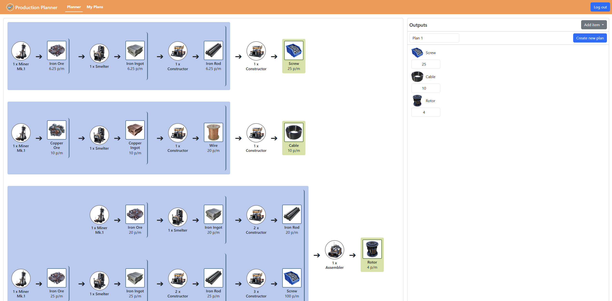

# Production Planner for Satisfactory Game

## About

This application is a Production Planner designed for players of the popular factory-building game, Satisfactory. The tool allows users to input the desired amount of items and calculate the necessary resources and machines. The planner makes use of preloaded JSON files containing game recipes.

This application is implemented using PHP with the MVC design pattern, leveraging relational databases for data management and ensuring a user-friendly and visually appealing interface using a CSS framework Bootstrap.



## Technical Implementation

- Backend:
  - PHP with MVC pattern for separation of concerns.
  - PDO for secure interaction with a MySQL relational database.
- Frontend:
  - HTML, CSS (using Bootstrap), and JavaScript for interactivity.
- Database:
  - Relational database design with tables for users, items, recipes, machines, and saved production plans.
- API:
  - Implement API endpoints to support for retrieving items, machines, recipes and production plans.
- Version Control:
  - Code versioning using Git.
- Docker setup including:
  - PHP interpreter
  - NGINX server
  - MySQL (MariaDB) database
  - PHP MyAdmin
- A locally included routing utility: [https://github.com/steampixel/simplePHPRouter](https://github.com/steampixel/simplePHPRouter)

## Usage

- Start local

In a terminal, from the cloned/forked/download project folder, run:

```bash
docker compose up
```

NGINX will now serve files in the app/public folder. Visit localhost in your browser to check.
PHPMyAdmin is accessible on localhost:8080

If you want to stop the containers, press Ctrl+C.

Or run:

```bash
docker compose down
```

In PHPMyAdmin run SQL scripts from the [app/public/assets/docs/database_scripts.txt](app/public/assets/docs/database_scripts.txt) to create tables and populate them with data.

## Functionalities

The application provides the following features:

- Production Planning:
  - Input desired items and quantities to calculate resource and machine requirements.
  - Automatically determine production chains based on standard recipes.
- User Accounts and Sessions:
  - Enable user accounts to save and retrieve personalized production plans.
- CRUD Operations:
  - Manage user-created personalized production plans (Create, Read, Update, Delete).
- Interactive Frontend:
  - Usage of JavaScript to allow real-time updates to production plans without refreshing the page.
- API Integration:
  - Provide JSON-based API endpoints for retrieving items, machines, recipes and production plans.
- Responsive Design:
  - The application works seamlessly across devices, including desktops, tablets, and smartphones.
- Security Features:
  - Secure user data and production plans against common threats like SQL injection and malicious JavaScript.
- Export and Import Functionality:
  - Export and import production plans in JSON format.
